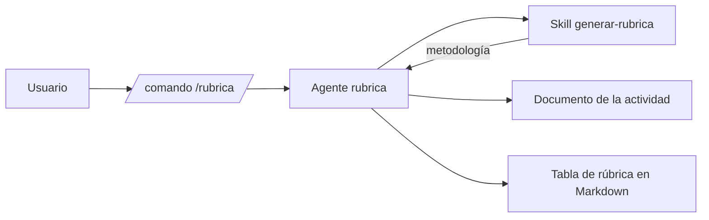

# Documento de diseño: Agente generador de rúbricas de evaluación

## 1. Contexto

Se parte de **actividad-3.md**: diseñar e implementar una arquitectura basada en
**comandos y skills de OpenCode** que, a partir de un documento con una
actividad evaluable, genere un borrador de una rúbrica de evaluación.

La actividad de prueba es la **Tarea 1 - Conversiones binario - decimal** (PDF,
en catalán), con seis tareas: aplicar el teorema fundamental de la numeración
a números decimales, convertir de binario a decimal, convertir de decimal a
binario, un ejercicio del libro, y dos definiciones conceptuales (informática y
código binario con su proceso de entrada/procesamiento/salida).

## 2. Arquitectura propuesta

La solución usa tres componentes de OpenCode, cada uno con una responsabilidad
clara y separada:

### 2.1 Skill `generar-rubrica`

- **Ubicación**: `.opencode/skill/generar-rubrica/SKILL.md`
- **Responsabilidad**: concentra el **conocimiento experto** del dominio de la evaluación. Define:
  - El flujo de 5 pasos (analizar actividad → solicitar criterios y niveles →
    proponer criterios → proponer descripciones y valores → emitir tabla
    Markdown).
  - Los **valores por defecto**: 5 criterios y 4 niveles
    (Excelente=10, Bueno=7, Suficiente=5, Insuficiente=0).
  - La **heurística de criterios** para actividades de conversión numérica
    (procedimiento/algoritmo, conversiones en ambos sentidos, conceptos
    teóricos, presentación) y las reglas para redactar descripciones
    progresivas y observables.
  - La **plantilla de salida** (tabla Markdown) y las pautas de lectura de PDF.
- **Importa porque**: el conocimiento es reutilizable y aparece en el contexto
  del agente solo cuando se necesita.

### 2.2 Comando `/rubrica`

- **Ubicación**: `.opencode/command/rubrica.md`
- **Responsabilidad**: es el **punto de entrada** del usuario. Recibe la ruta
  del documento como argumento (`$1` / `$ARGUMENTS`), selecciona el agente
  `rubrica` y despliega el prompt que activa el flujo completo.
- **Importa porque**: simplifica la invocación a `/rubrica <documento>` y evita
  que el usuario tenga que describir la tarea cada vez.

### 2.3 Agente `rubrica`

- **Ubicación**: `.opencode/agent/rubrica.md`
- **Responsabilidad**: **orquesta** el flujo. Analiza el documento (leyéndolo o
  extrayendo el texto del PDF), ejecuta la metodología de la skill, formula las
  preguntas de parámetros (paso 2), y devuelve la rúbrica como tabla Markdown.
- **Seguridad**: declarado en `mode: primary` y con `permission.edit: deny`,
  de modo que el agente **no puede modificar ficheros** del repositorio y actúa
  en modo consulta/propuesta.

## 3. Flujo de ejecución

1. El usuario invoca `/rubrica <ruta-del-documento>`.
2. El comando activa el agente `rubrica` con la ruta como argumento.
3. El agente lee el documento (extrae el texto si es PDF) e identifica tareas y
   objetivos de aprendizaje.
4. El agente pregunta al usuario el **número de criterios** y el **número de
   niveles** (por defecto: 5 × 4).
5. El agente propone los **criterios de evaluación** y sus **descripciones y
   valores numéricos** por nivel.
6. El agente devuelve la **rúbrica en una tabla Markdown**.

## 4. Decisiones de diseño

| Decisión | Justificación |
|---|---|
| Conocimiento en una skill, no en el comando | Favorece la reutilización y mantiene modular la arquitectura |
| Agente orquestador separado | Separa el "quién" (agente) del "cómo" (skill) y del "punto de entrada" (comando) |
| Agente de solo lectura (`edit: deny`) | El borrador se propone en la conversación; los entregables se consolidan aparte |
| Valores por defecto 5 criterios × 4 niveles | Equilibrio estándar en rúbricas educativas (nota 0-10, 4 niveles de logro) |
| Salida en castellano | Idioma del enunciado y del diseño; la tarea analizada es en catalán |
| Heurística específica para conversiones numéricas | Asegura criterios directamente ligados a los apartados reales de la Tarea 1 (teorema fundamental, binario→decimal, decimal→binario, conceptos, entrega) |

## 5. Entregables

- Este documento de diseño.
- `.opencode/skill/generar-rubrica/SKILL.md`
- `.opencode/command/rubrica.md`
- `.opencode/agent/rubrica.md`
- `rubrica-ejemplo.md`: ejemplo de ejecución con la rúbrica generada para la
  Tarea 1 (5 criterios × 4 niveles).

## 6. Uso

1. Reiniciar OpenCode para que cargue la configuración nueva.
2. Ejecutar: `/rubrica "Tarea 1 - Conversiones binario - decimal (1).pdf"`.
3. Responder a las preguntas de criterios y niveles (o aceptar los valores por
   defecto) y recibir la tabla Markdown con la rúbrica.